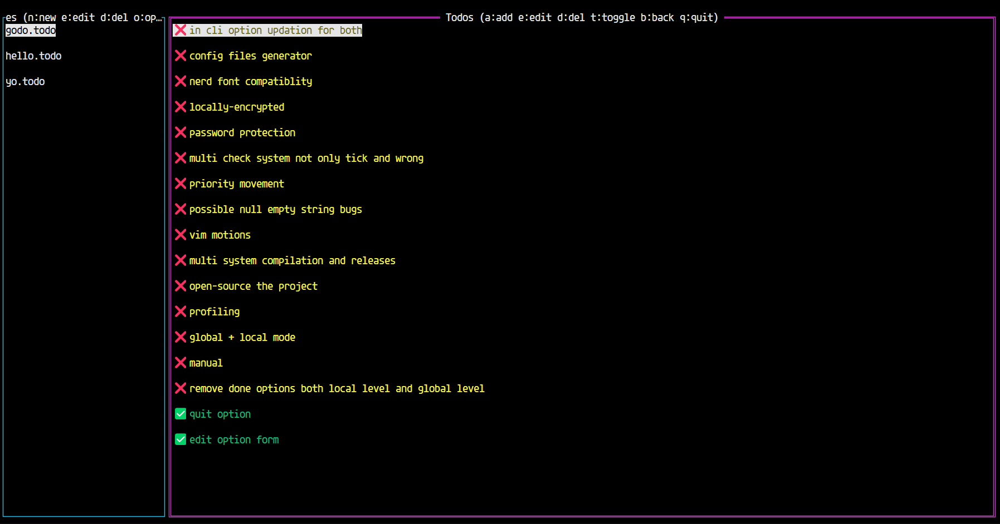

# GoDo

A terminal-based todo list manager with customizable colors and keybindings, written in Go.

 _(Note: Add actual screenshot later)_

## Features

- 📝 Manage multiple todo lists in separate files
- ✅ Color-coded todo items (configurable)
- 🎨 Customizable UI colors
- ⌨️ Fully configurable keybindings
- 🖥️ Intuitive terminal interface
- 💾 Automatic saving of todos
- 🔄 Real-time refresh of lists

## Installation

### Prerequisites

- Go 1.16+ installed
- Terminal with 256-color support recommended

### Build from Source


```bash
git clone https://github.com/AnomitraSarkar/GoDo
cd GoDo
go build -o godo.exe main.go 
```

> ***Note*** :The build depends on your machine platform

### Running

```bash
./todo
```

## Configuration

The application reads from `config.json` in the same directory. A default configuration will be created if none exists.

### Example config.json

```json
{
  "undoneColor": "yellow",
  "doneColor": "green",
  "activeWindowColor": "purple",
  "unactiveWindowColor": "aqua",
  "priorityColor": "black",
  "relativeTime": true,
  "keymap": {
    "newFile": "n",
    "editFile": "e",
    "delFile": "d",
    "openFile": "o",
    "addTodo": "a",
    "editTodo": "e",
    "delTodo": "d",
    "toggle": "t",
    "back": "b",
    "quit": "q",
    "moveToTop": "g",
    "moveToBottom": "G",
    "setPriority": "p"
  }
}
```

### Color Options

Use any standard color name or hex value:

- Named colors: `red`, `blue`, `green`, etc.
- Hex values: `#ff0000`, `#00ff00`, etc.
- XTerm colors: `darkred`, `lightblue`, etc.

## Usage

### File Management (Left Panel)

| Action         | Default Key | Description              |
| -------------- | ----------- | ------------------------ |
| New File       | n           | Create a new todo file   |
| Edit File Name | e           | Rename current todo file |
| Delete File    | d           | Remove current todo file |
| Open File      | o           | Open selected todo file  |
| Quit           | q           | Exit the application     |

### Todo Management (Right Panel)

| Action        | Default Key | Description           |
| ------------- | ----------- | --------------------- |
| Add Todo      | a           | Add new todo item     |
| Edit Todo     | e           | Modify todo text      |
| Delete Todo   | d           | Remove todo item      |
| Toggle Status | t           | Mark todo done/undone |
| Back to Files | b           | Return to file list   |
| Quit          | q           | Exit the application  |

## File Storage

Todo files are stored in the `todos/` directory with `.todo` extension. Each file contains JSON-formatted todo items.

### Example todo file

```json
[
  { "text": "Buy groceries", "done": false },
  { "text": "Finish project", "done": true }
]
```

## Customizing Keybindings

Edit the `keymap` section in `config.json`. You can use:

- Single characters: `"a"`, `"b"`, etc.
- Special characters: `"@"`, `"!"`, etc.
- Case doesn't matter (treated as lowercase)

## Troubleshooting

### Common Issues

- **Colors not working**: Ensure your terminal supports 256 colors
- **Files not saving**: Check write permissions in the todos directory
- **Keybindings not working**: Verify config.json is valid JSON

## Contributing

Contributions are welcome! Please open an issue or pull request for any:

- Bug fixes
- New features
- Documentation improvements

> **_Note_**
> A list of improvements/features are provided in the Todos of the github repo itself, which might be seen on startup godo in the source directory itself.

## License

MIT License - see [LICENSE](LICENSE) for details.

Created BY: **_ANOMITRA SARKAR_**
